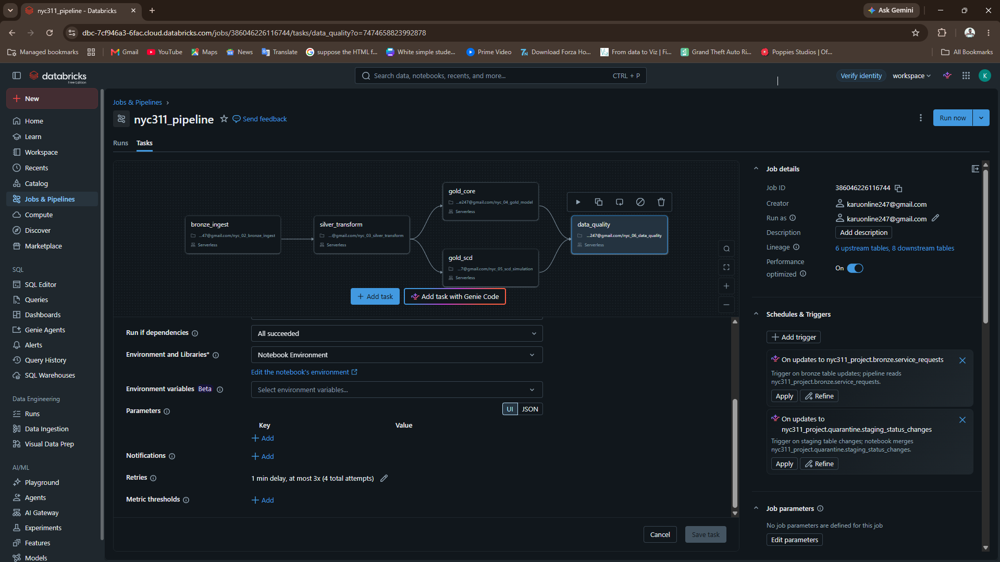

# NYC 311 Advanced ELT Pipeline — Databricks

A follow-up to my first Databricks project, built to go deeper into production-style pipeline patterns: genuinely messy source data, conditional branching with a quarantine table, a Slowly Changing Dimension (SCD Type 2), parallel task orchestration, and retry/alerting — using NYC's real 311 Service Request data.

## Why this project

My first pipeline (Olist e-commerce) used a clean, well-known dataset and a simple linear bronze → silver → gold chain. This project deliberately targets what that one didn't cover: real-world messy data, pipelines that branch and run in parallel rather than strictly in sequence, and the kind of resilience/alerting patterns expected in production.

## Architecture

```
NYC 311 Open Data API (Socrata, filtered to a 6-month slice, 200K rows)
            │
            ▼
      bronze_ingest
            │
      silver_transform
      (cleaning + casing fixes + quarantine split)
         /         \
   gold_core     gold_scd
  (dims + fact)  (SCD Type 2 on
                  complaint status)
         \         /
        data_quality
```
Both `gold_core` and `gold_scd` depend only on `silver_transform` and run **in parallel**, converging into a shared `data_quality` stage — a real branching DAG, not a linear chain.

## Tech stack

Databricks (Free Edition), PySpark, Delta Lake, Unity Catalog, Databricks Workflows (parallel tasks, retries, failure alerting), Socrata Open Data API.

## Dataset

[NYC 311 Service Requests from 2020 to Present](https://data.cityofnewyork.us/Social-Services/311-Service-Requests-from-2020-to-Present/erm2-nwe9) — pulled directly via the public Socrata API (no manual download), filtered server-side to a 6-month window, ~200,000 rows.

## Pipeline walkthrough

**Bronze** — raw API response landed as-is into a Delta table, with an `_ingested_at` audit column.

**Silver** — this is where the real cleaning work happened:
- Dropped 9 columns that were 90%+ null because they only apply to niche complaint types (bridge/highway, taxi, vehicle complaints) — rather than carrying near-empty columns into the main table.
- Fixed inconsistent text casing (`"UNSANITARY CONDITION"` vs `"Dirty Condition"` → standardized to Title Case).
- Converted the placeholder value `"Unspecified"` into a real null, so it stops being miscounted as a legitimate category.
- **Found and fixed a root-cause data corruption bug**: the initial data load cast every column to string (`.astype(str)`), which silently turned true missing values into the literal text `"None"`/`"nan"` instead of real nulls — invisible to standard null checks until a `to_timestamp()` cast hard-failed on it. Fixed by explicitly replacing these placeholder strings with real nulls across every string column before any further processing.
- **Quarantine split**: rows missing all three location identifiers (zip, city, latitude) — meaning the complaint can't be mapped or geo-analyzed — are routed to a separate `quarantine.service_requests_unlocatable` table instead of being silently dropped or silently kept. 947 of 200,000 rows (0.47%) were quarantined.

**Gold** — two independent branches:
- `gold_core`: `dim_agency`, `dim_location`, and `fact_requests`.
- `gold_scd`: `dim_complaint_status`, a **Slowly Changing Dimension (Type 2)** tracking each complaint's status history with `valid_from`/`valid_to`/`is_current` columns, so a status change (e.g. In Progress → Closed) is recorded as a new row rather than overwriting history.

## SCD Type 2 — built and verified

Simulated a second day's data where a subset of open complaints transition to "Closed," then ran a Delta `MERGE` to close out the old row (`is_current = false`, `valid_to` set) and insert the new current row. Verified on 5 tracked complaint IDs that both the historical and current versions are preserved correctly, each with its own timestamp:

| unique_key | status | is_current | valid_to |
|---|---|---|---|
| 61656601 | Open | false | 2026-10-06 |
| 61656601 | Closed | true | – |

**A real bug worth documenting**: my first merge attempt silently failed to close out old rows, because the "incoming changes" DataFrame was built as a live lazy reference back into the same table being merged into — a classic Delta/Spark self-reference trap. Fixed by materializing the incoming changes as an independent staging table before merging. A later cleanup step (removing bad rows from that failed attempt) also over-deleted 1,517 valid dimension rows, caught by a referential integrity check against the fact table, and fixed with a clean rebuild.

## Orchestration

A Databricks Workflow with 5 tasks: `bronze_ingest` → `silver_transform` → (`gold_core` ∥ `gold_scd`, running in parallel) → `data_quality`. Every task has a retry policy (2 retries, 1-minute delay) to handle transient failures, and the job has an email notification configured to fire on failure — so a broken pipeline surfaces automatically rather than silently failing.



## Data quality checks

Row-count reconciliation across bronze/silver/quarantine, null checks on key columns, duplicate key checks, an **SCD2 integrity check** (every complaint must have exactly one "current" row — confirmed 0 violations), and a **referential integrity check** between `fact_requests` and `dim_complaint_status` (confirmed 0 orphaned rows after fixing the over-deletion bug above).

## Repository structure

```
notebooks/   — Databricks notebooks (exported as .py source files)
screenshots/  — pipeline and data quality evidence
```

## How to reproduce

1. Import the notebooks into a Databricks workspace with Unity Catalog enabled.
2. Run `00_fetch_data` to pull a fresh slice from the NYC 311 Socrata API (no credentials needed).
3. Run `nyc_01_explore_raw` through `nyc_06_data_quality` in order, or set them up as a Databricks Workflow with `gold_core` and `gold_scd` both depending on `silver_transform`, and `data_quality` depending on both.

## What I'd do next

- Add parameterized, config-driven ingestion if extending this to multiple NYC Open Data sources.
- Extend SCD Type 2 to a real multi-day load instead of a single simulated transition.
- Add automated data quality gating — fail the pipeline (not just alert) if quarantine volume crosses a defined threshold.

---
Built by Kartheek Bhimavarapu
